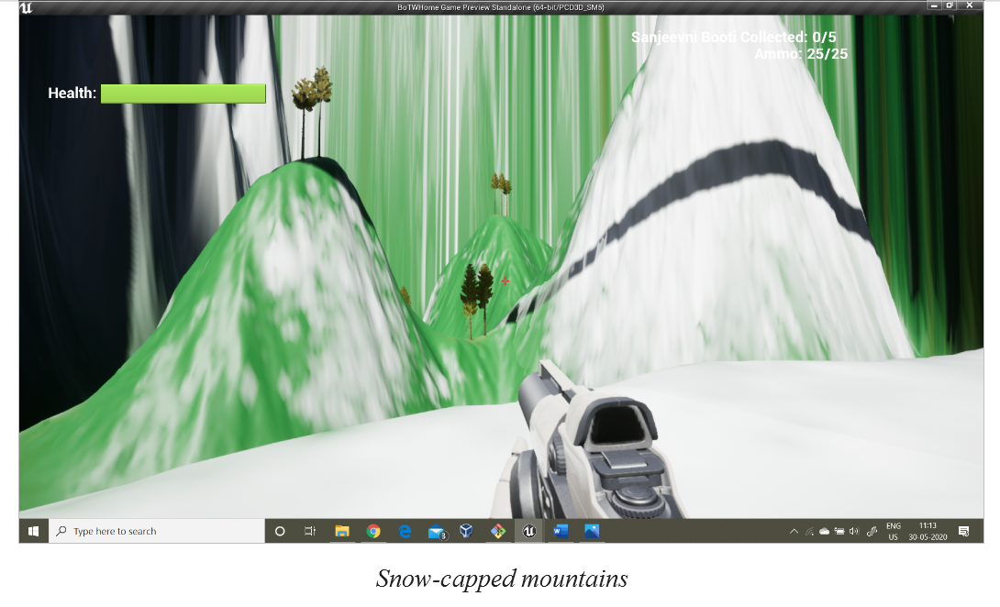

# ArxInsania
## It's raining pumpkins!  

You are an explorer on a quest to find the mythical Sanjeevni Booti scattered across undulated and mountainous terrains – with lush green plateaus, snow-capped mountains, shady forests and much more. However, nature is not in your favour, with giant pumpkins falling from the sky, threatening to crush you on impact. You need to make your way through 5 levels, with each level containing 5 Sanjeevni Booti to be collected, which are hidden under boulders that can be broken with projectiles.  

  

  

  

## Controls
- Up: W
- Left: A
- Down: S
- Right: D
- Change View: Mouse movement
- Shoot: Left mouse click
- Jump: Spacebar
- Pause: P
- Pray (at Ram Mandir): J
- Continue to next level (upon current level completion): C

## Objective
In each of the 5 levels, you start from home and go outside to confront the vast world in front of you. There are boulders scattered over the map, with some of them having a Sanjeevni Booti hidden under them. Your objective is to collect the 5 Sanjeevni Booti that are hidden and return home. A boulder can be broken by shooting it 3 times. You start with an ammo of 25, and each time you shoot consumes 1 ammo. There is a health bar that gets depleted upon getting hit by a falling giant pumpkin. Giant pumpkins knock you back if they land on you, and splatter upon making contact with the ground. Be careful not to get hit by any of the pumpkin fragments either – they hurt too!

  

  

  

  

The HUD displays the following:
- Health bar
- Ammo
- Number of Sanjeevni Booti collected

To support you on your quest, there is one Ram Mandir in each level. You can pray in its proximity by pressing J to fully restore your health and ammo. The home and Ram Mandir are also safe-spots where the giant pumpkins stop falling from the sky, making them ideal places for taking a breather and appreciating the beauty around without worrying about getting struck down.

  

  
  
  
*Pro tip:* Watch out for the shadows of falling giant pumpkins on the ground - they give an idea as to where giant pumpkins are about to land so you can dodge them!

  

Not all boulders have Sanjeevni Booti hidden under them – you may end up expending all your ammo several times through the quest. Make sure you find and take a mental note of the location of the Ram Mandir on your level so you can revisit it when running out of ammo or health.  

Once you are done collecting all 5 Sanjeevni Booti, head back home. You'll be given an option to proceed to the next level by pressing C, and also shown a code in the HUD that gives you instant access to the next level from the menu screen – make sure you note it down before hitting C! Each level has a different terrain. Levels get incrementally larger, and harder - with more areas to explore, and more giant pumpkins raining down!  

  

  

 

All the best for your quest!
- Taejas and Viresh

## Download From
Get Installer for Windows -  https://drive.google.com/open?id=1ti80Cz2ssgaUEv-CJpA8cq1JC-kaeU3n

Get Portable version for Windows - https://drive.google.com/open?id=11gJL3_9v_qnHWKRKul8ObFAZ7h8Zo5e-

## Acknowledgements
Developed with Unreal Engine 4 using free asset packs  
Game Developed as a part of Game Design and Development course @ IIITD during 2020 winter semester  
